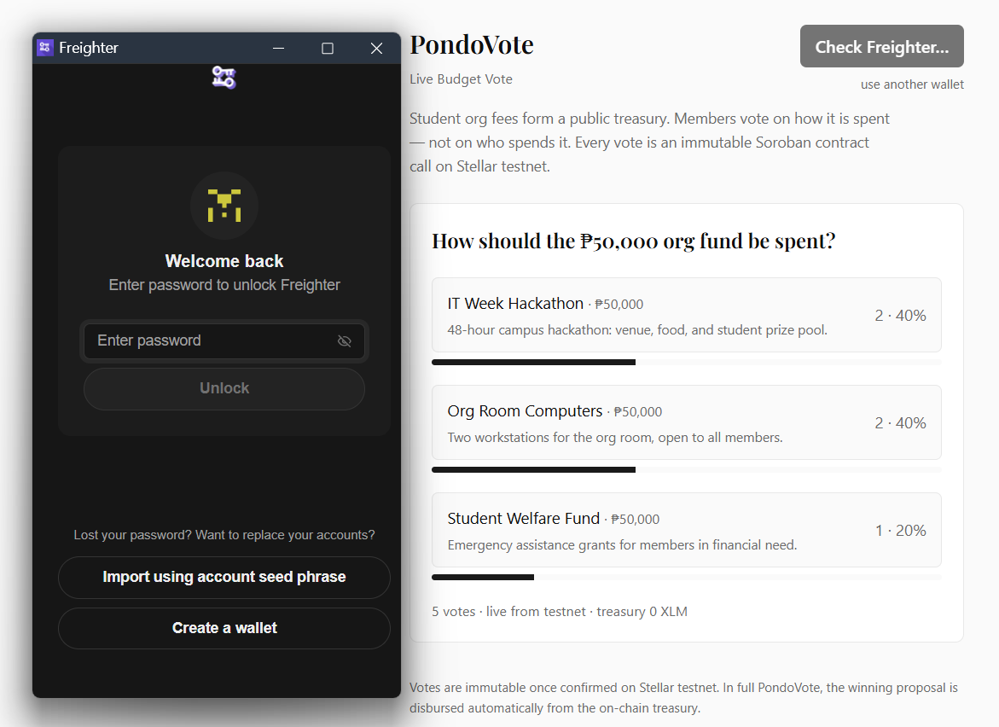
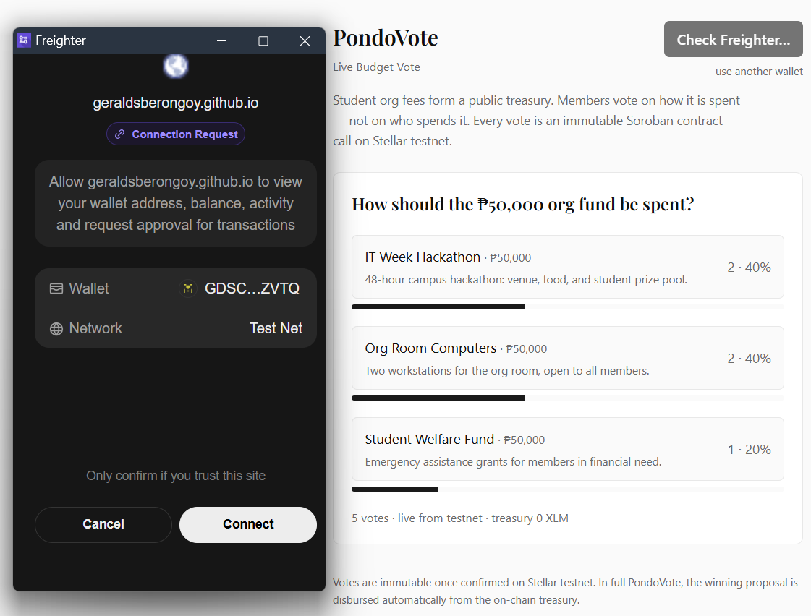
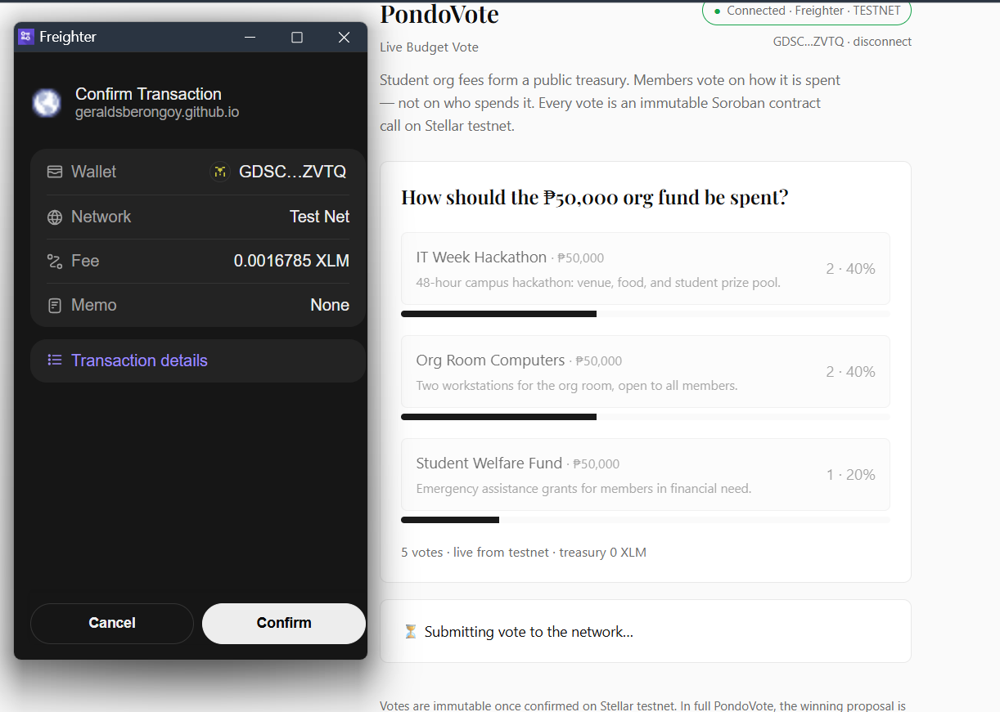
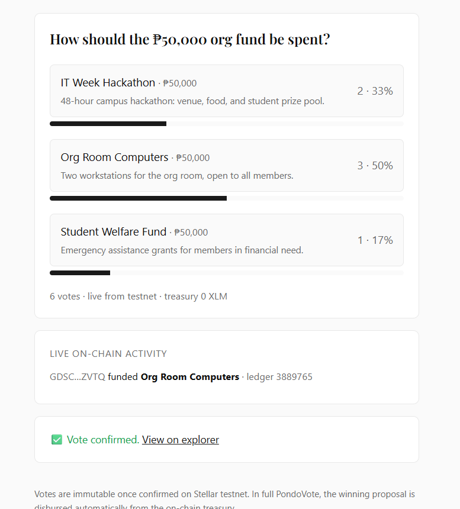
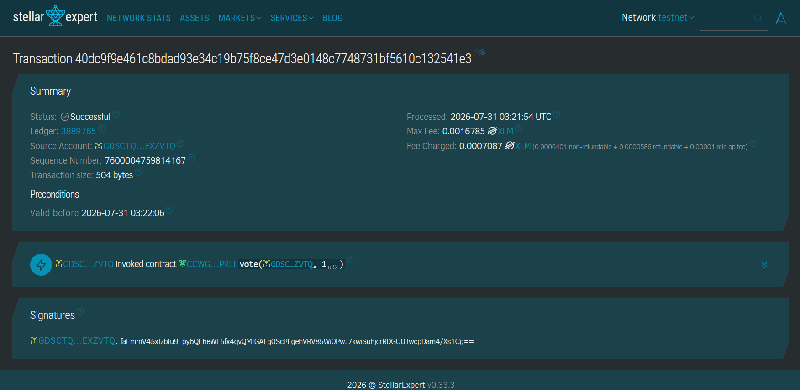

# 🗳️ PondoVote — Live Budget Vote (Yellow Belt / Level 2)

A multi-wallet dApp on **Stellar Testnet**. One on-chain participatory-budgeting vote: connect any
Stellar wallet, allocate the org fund through a **Soroban smart contract**, and watch results and
contract events update in real time.

Built for the Risein *Stellar: Journey to Mastery* **Level 2 / Yellow Belt** challenge.

## Submission at a glance

| Checklist item | Where |
| --- | --- |
| Deployed contract address | `CCWGZ23DOQLBHQ4S52CKDXREOJ77L4COIL25L6AUMEK5N7DTLZC7PRLI` — [Deployment info](#-deployment-info) |
| Transaction hash of a contract call | [`40dc9f9e…`](https://stellar.expert/explorer/testnet/tx/40dc9f9e461c8bdad93e34c19b75f8ce47d3e0148c7748731bf5610c132541e3) (Freighter-signed `vote`) |
| Screenshots | [full vote walkthrough](#-screenshots) |
| Setup instructions | [Setup](#setup) |
| Live demo (optional) | **https://geraldsberongoy.github.io/pondovote-yellow-belt/** |

## What this is

This is the Yellow Belt deliverable for **PondoVote** — transparent participatory budgeting for
Philippine student organizations. Students pay council fees but rarely see how the money is managed.
PondoVote turns those fees into a public on-chain treasury and lets verified members vote on *how the
funds are spent*, not on who spends them. The winning proposal is disbursed automatically.

This app is the voting slice of that idea, kept deliberately small to fit Level 2: a single live
budget question, three real proposals, one lightweight `vote` contract call per member.

- **Voting contract used here:** `contracts/poll` (this repo) — one call per vote, instant tally, so
  results are genuinely real-time.
- **PondoVote treasury (read-only in this app):**
  `CC2Y445ZG6EA5ZQQUCHPVESRCZHA5HW5G4VSCT5I5FIA23S6GC5T4OFX` — the UI simulates `get_balance` to show
  the actual fund pool a vote allocates.
- **Production voting contract:** `CDW2KLIL6VXNUVEADHPNMLUGXI4NSV3V6LLEBSLUKKBRUVG4YKQFEQQY` — uses
  commit-reveal plus automated treasury disbursement. It is intentionally *not* wired here: commit and
  reveal are two transactions behind deadlines, so no tally exists until the reveal window closes,
  which would defeat the Level 2 real-time requirement.

## Requirements coverage

| Requirement | How it's met |
| --- | --- |
| Multi-wallet integration | `StellarWalletsKit` — "Connect Freighter" goes straight to Freighter, "use another wallet" opens the kit picker (xBull, Albedo, Lobstr, Hana, …). Connected network is read back from the wallet and flagged if it is not TESTNET (`web/src/lib/wallet.ts`) |
| 3 error types handled | Wallet not found · signature rejected · insufficient balance (`web/src/app/page.tsx`, `classifyError`) |
| Contract deployed on testnet | `contracts/poll` Soroban contract (address below) |
| Contract called from frontend | `vote()` write + `get_results()` read via Soroban RPC (`web/src/lib/poll.ts`) |
| Transaction status visible | `idle → pending → success/fail` with explorer link |
| Real-time integration | `get_results()` polled every 3s + optimistic update |
| Event listening / state sync | `getVoteEvents()` streams contract `vote` events via Soroban RPC `getEvents` into a live activity feed (`web/src/lib/poll.ts`, `page.tsx`) |
| Second contract read | `get_balance()` on the PondoVote treasury contract |

## 📸 Screenshots

A full vote, end to end, against the deployed contract on testnet.

### 1. Wallet gate

Clicking **Connect Freighter** wakes the extension; the button reads `Check Freighter…` while the
request is in flight, so a click is never silent.



### 2. Wallet connection request

Freighter asks the user to authorise the origin, showing the account and the network it will connect
with. The app then reads that network back and flags anything that is not TESTNET.



### 3. Signing the vote

The `vote` contract call goes to Freighter for signature — wallet, network and fee are shown before
approval — while the app sits in its `pending` state.



### 4. Confirmed, tallied and streamed back

The tally updates, the `vote` event arrives in the live on-chain activity feed, and the transaction
status turns green with an explorer link. Header badge shows `● Connected · Freighter · TESTNET`.



### 5. Verifiable on Stellar Explorer

The same transaction on stellar.expert: `GDSC…ZVTQ invoked contract CCWG…PRLI vote(GDSC…ZVTQ, 1_u32)`.



### Wallet options available

> **Still to capture:** click **use another wallet** and screenshot the StellarWalletsKit picker
> listing Freighter, xBull, Albedo, Lobstr, Hana, … Save it as `screenshots/wallets.png`. The Level 2
> checklist asks for this one specifically, and the shots above only show Freighter.


## 🔗 Deployment info

- **Deployed contract address:** `CCWGZ23DOQLBHQ4S52CKDXREOJ77L4COIL25L6AUMEK5N7DTLZC7PRLI`
  - Explorer: https://stellar.expert/explorer/testnet/contract/CCWGZ23DOQLBHQ4S52CKDXREOJ77L4COIL25L6AUMEK5N7DTLZC7PRLI
  - Deploy tx: https://stellar.expert/explorer/testnet/tx/9b05c9db5bd0264771f8d2d3640216f326c8c1948d40f5fe6b9748682e5d74e3

### Verifiable `vote` calls (signed in-browser with Freighter)

| Option voted | Tx hash | Explorer |
| --- | --- | --- |
| 1 — Org Room Computers | `40dc9f9e461c8bdad93e34c19b75f8ce47d3e0148c7748731bf5610c132541e3` | [view](https://stellar.expert/explorer/testnet/tx/40dc9f9e461c8bdad93e34c19b75f8ce47d3e0148c7748731bf5610c132541e3) — pictured above |
| 0 — IT Week Hackathon | `528abe004c1a61e378f1de66e800b355cf25badea326d2870dfb0141da6bac68` | [view](https://stellar.expert/explorer/testnet/tx/528abe004c1a61e378f1de66e800b355cf25badea326d2870dfb0141da6bac68) |
| 2 — Student Welfare Fund | `ef2a8bfc8e63cd4308b9a5e603800fd68b94d90b2f352143d5a2bc4d3022c6af` | [view](https://stellar.expert/explorer/testnet/tx/ef2a8bfc8e63cd4308b9a5e603800fd68b94d90b2f352143d5a2bc4d3022c6af) |

Both were signed by wallet `GDSCTQZRRGF23F5GWNE3FYLLPEGO23BB3RQ6AYO5756C7A4HJLEXZVTQ` through the
frontend. Each emits a `vote` event, e.g. `[{"symbol":"vote"},{"address":"GDSCTQZR…ZVTQ"}] = {"u32":0}`,
which is what the live activity feed reads back via `getEvents`.

CLI-signed reference calls: [`7dc6d4b7…`](https://stellar.expert/explorer/testnet/tx/7dc6d4b740eb953c6a79739754ce667eec7e45f460861696313e5204d7c7932e)
· [`6613289a…`](https://stellar.expert/explorer/testnet/tx/6613289a2b7f200438a6e3100509b75c1d90efdff5b0e6443135cea01709dcb9)

- **Live demo:** https://geraldsberongoy.github.io/pondovote-yellow-belt/ — static export deployed by
  `.github/workflows/pages.yml` on every push to `main`. It is the same client-side app: the browser
  talks straight to Soroban RPC and your wallet, so no server is involved.

## Stack

Next.js 16 · React 19 · TypeScript · Tailwind v4 · `@stellar/stellar-sdk` **16.2** · `@creit.tech/stellar-wallets-kit` · Soroban (Rust).

> `@stellar/stellar-sdk` must be **>= 16**. On 13.x, testnet responses containing protocol-23
> `ScAddress` variants fail to decode and a confirmed vote surfaces as `Bad union switch: 4`.

---

## Setup

### 1. Toolchain (one-time)

```bash
# Rust
winget install Rustlang.Rustup           # or download rustup-init.exe
rustup target add wasm32v1-none

# Stellar CLI
winget install --id Stellar.StellarCLI    # or: cargo install --locked stellar-cli

# Fund a deployer identity on testnet
stellar keys generate --global deployer --network testnet --fund
```

### 2. Build, deploy & initialize the contract

```bash
cd contracts/poll
stellar contract build

# Deploy -> prints the CONTRACT_ID
stellar contract deploy \
  --wasm target/wasm32v1-none/release/poll.wasm \
  --source deployer --network testnet

# One-time init: question symbol + number of options (matches the 3 UI options)
stellar contract invoke --id <CONTRACT_ID> \
  --source deployer --network testnet \
  -- init --question usecase --num_options 3
```

Put the printed `CONTRACT_ID` in `web/.env.local`:

```
NEXT_PUBLIC_CONTRACT_ID=<CONTRACT_ID>
# optional — PondoVote treasury shown in the UI; defaults to the deployed one
NEXT_PUBLIC_TREASURY_ID=<TREASURY_CONTRACT_ID>
```

(or hardcode it in `web/src/lib/poll.ts`), and update the address/tx-hash placeholders above.

### 3. Run the frontend

```bash
cd web
npm install
npm run dev            # http://localhost:3000 (Next picks the next free port if taken)
```

Install [Freighter](https://www.freighter.app/), switch it to **Testnet**, and fund the account via
https://friendbot.stellar.org. Click **Connect Freighter** (Freighter shows its approval popup the
first time this origin asks; revoke under Freighter > Settings > Connected apps to see it again), then
vote — the tally, the transaction status and the on-chain activity feed all update within ~3s.

## Contract API (`contracts/poll/src/lib.rs`)

- `init(question: Symbol, num_options: u32)` — one-time setup.
- `vote(voter: Address, option: u32)` — `require_auth()`, increments the count, emits a `vote` event.
- `get_results() -> Vec<u32>` — live tally, index = option.
- `get_question() -> Symbol`.

Run the contract tests: `cd contracts/poll && cargo test`.
